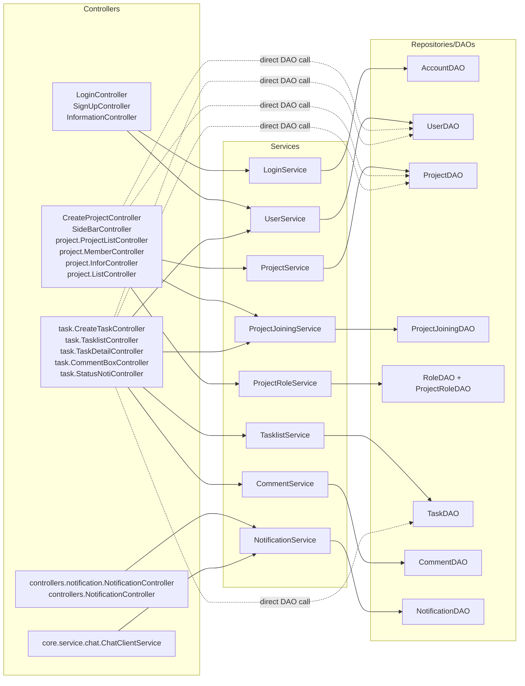
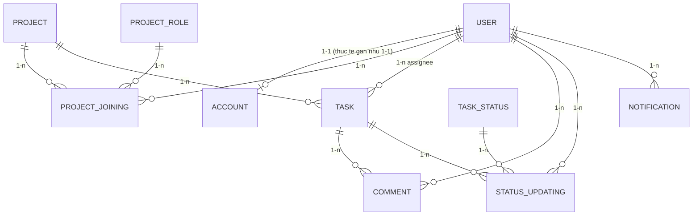

# PROJECT_GRAPH

## 1) Kien truc Controller -> Service -> Repository

> Ghi chu: Trong project nay, lop `Repository` duoc trien khai duoi dang cac class `DAO` trong package `com.app.src.daos`.

## 2) Muc dich tung module chinh

- `controllers/`: Xu ly su kien UI (FXML), dieu huong man hinh, bind du lieu vao view.
- `controllers/project`, `controllers/task`, `controllers/notification`: Chia theo domain man hinh de giam coupling.
- `services/`: Chua business logic, validation, orchestration transaction/flow, goi DAO.
- `daos/`: Tang truy cap CSDL (SQL, mapping ResultSet -> model/DTO).
- `models/`: Entity domain (User, Project, Task, Comment, Notification, ...).
- `dtos/`: Doi tuong truyen du lieu cho UI/use-case dac thu (vd `PersonalTaskDTO`).
- `core/`: Ha tang runtime (AppContext, session, DB connection, async executor, chat socket, plugin host).
- `exceptions/`: Loi tap trung (`AppException`, `ServiceException`, `DataAccessException`, `GlobalExceptionHandler`).
- `authentication/`: Rule role/visibility (an-hien tinh nang theo role).
- `resources/scenes` + `resources/components`: FXML cho scene tong va reusable component.
- `resources/Database`: SQL schema + script seed tao du lieu mau.

## 3) Thuc the quan trong va quan he du lieu

### Tom tat nhanh cardinality quan trong

- `USER <-> PROJECT` la quan he `n-n`, duoc tach qua bang trung gian `PROJECT_JOINING` (co them `Role_id`, `PJo_dateJoin`).
- `PROJECT -> TASK` la `1-n`.
- `TASK -> COMMENT` la `1-n`, moi comment thuoc 1 task va 1 user.
- `TASK -> STATUS_UPDATING` la `1-n` de luu lich su chuyen trang thai.
- `USER -> NOTIFICATION` la `1-n`.

## 4) Ghi chu kien truc hien tai (de nho khi tra cuu nhanh)

- Dang ton tai ca `com.app.src.controllers.NotificationController` va `com.app.src.controllers.notification.NotificationController` (2 controller khac namespace).
- Mot so controller dang goi DAO truc tiep (bo qua service), co the xem la technical debt can refactor de dong nhat layer.
- `AppContext` giu state dung chung (user session + list project), duoc dung de render nhanh tren nhieu scene.
- `core.async.AsyncExecutor` + `GlobalExceptionHandler` la ha tang quan trong cho xu ly background thread va loi tap trung.

